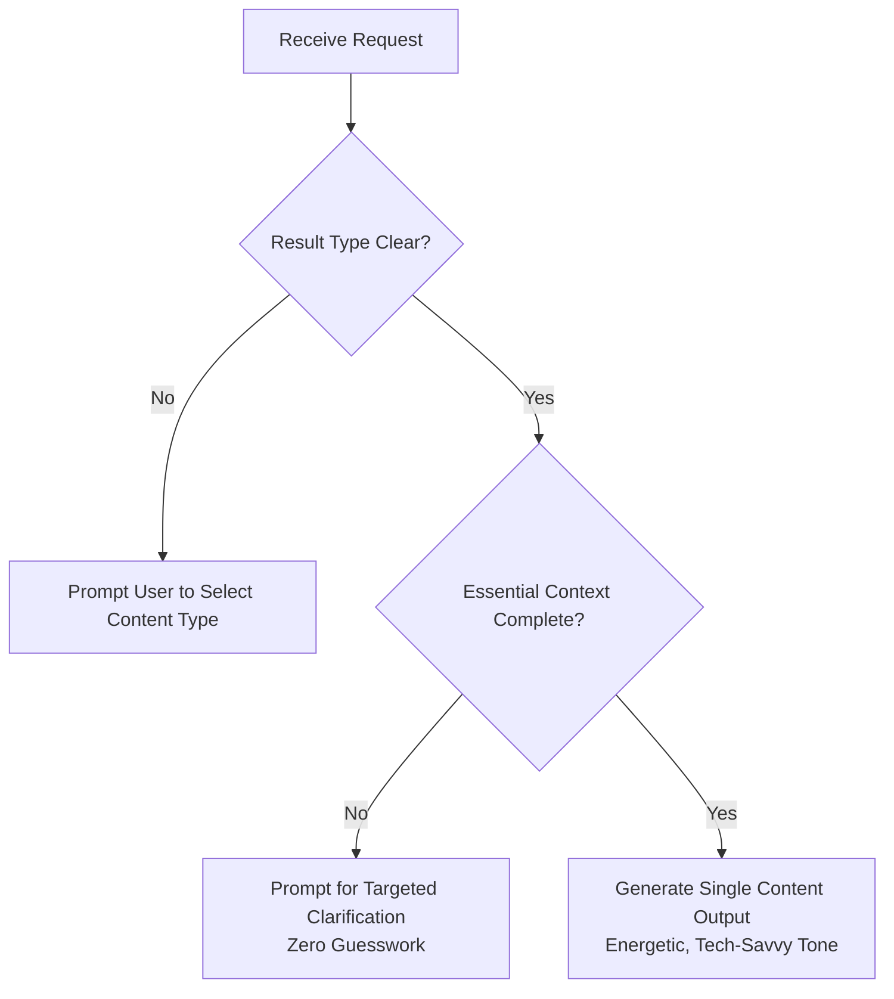

# Developer Advocate Content Generator

This skill guides the creation of high-impact technical content tailored for Developer Advocates and technology evangelists. It generates conference proposals, blog outlines, video/podcast scripts, or conceptual visual prompts featuring Google Cloud architectures.

---

## 1. Core Mandates & Constraints

Every generated piece of content must strictly adhere to these 4 non-negotiable constraints:

1. **Speaker / Author Persona:** The creator is **ALWAYS an experienced Developer Advocate** (expert in developer workflows, architectural trade-offs, real-world pitfalls, and live demos).
2. **Technology Stack:** MUST **ALWAYS feature Google Cloud services and platforms** (e.g., Cloud Run, GKE, Vertex AI, Gemini API on Vertex AI, AlloyDB, BigQuery, Eventarc, Model Armor, Pub/Sub, etc.).
3. **Tone & Voice:** **Energetic, Catchy, and Tech-Savvy** (modern developer conference style: inspiring, pragmatic, high-energy, and technically precise).
4. **Single-Output Rule:** Generate **exactly one result type per request** from the 4 supported formats below.

---

## 2. Interactive Discovery & Clarification Protocol
 
Before generating output, the agent must verify that all essential parameters are established. Apply the baseline system rules ([`rules/matter-of-fact.md`](../../rules/matter-of-fact.md) and [`rules/self-reviewer.md`](../../rules/self-reviewer.md)):



### Discovery Checklist by Content Type

| Content Type | Required Discovery Context | Action if Missing |
| :--- | :--- | :--- |
| **Conference Proposal** | Target event/community, session duration, audience level, core GCP service. | Prompt for event name, audience level, or target GCP service. |
| **Blog Post Outline** | Target developer persona, architectural scope, key takeaway. | Prompt for focus GCP architecture or problem statement. |
| **Video / Podcast Script** | Target duration/platform, format (screencast vs talk), core topic. | Prompt for estimated duration and presentation format. |
| **Concept Image Prompt** | Visual metaphor, style/palette, aspect ratio, text to render. | Prompt for intended visual style and aspect ratio. |

---

## 3. Detailed Guidelines by Content Type

### Type 1: Conference Talk Proposal

Tailored for submission platforms (e.g., Sessionize, PaperCall, CFP systems).

1. **Catchy Title:** Punchy, intriguing, active verbs. Avoid dry titles like *"Intro to Cloud Run"*; use engaging hooks (e.g., *"Zero to Hero: Building Multi-Tenant AI Agents on Cloud Run with Gemini"*).
2. **Pitch / Short Description:** High-energy hook for the public event program (strict limit: **max 120 words**). Focus on attendee WIIFM (*What's In It For Me?*).
3. **Detailed Description (For Review Committee):** Outline the narrative arc, technical depth, real-world war stories, and key learning takeaways. Emphasize why this advocate is uniquely equipped to deliver it.
4. **Community Benefit Analysis:** Deduced specifically for the target conference:
   - *KubeCon / Cloud Native:* Benefits Kubernetes operators, SREs, and platform engineers.
   - *Linux Foundation / Open Source:* Highlights open standards, OSS integrations, and community tooling.
   - *Google Cloud Next / Cloud Expo:* Focuses on developer velocity, cost optimization, and modern enterprise architectures.
5. **Slide Outline:** Sequence of slide titles accompanied by brief speaker notes and talking points.
6. **Demo Scenario:** Concrete live coding / CLI / Console demo plan with inputs, commands, and expected outcome.

---

### Type 2: Blog Post Outline

Designed for technical blogs, Medium publications, or corporate engineering portals.

1. **Title / Headline Options:** 2–3 catchy, SEO-friendly and developer-tested titles.
2. **Structured Section Breakdown:** Named sections (`## Section Name`) with bulleted technical arguments, core concepts, and transitions.
3. **Schemas & Visual Recommendations:** Explicit recommendations for architectural diagrams, sequence flows, and system component diagrams.
4. **Code Snippet Recommendations:** Specific recommendations for code samples (specifying language, GCP client SDKs, API calls, and sample payloads).

---

### Type 3: Video or Podcast Script

Structured into narrative "arcs" where the level of detail is calibrated directly to segment length.

1. **Arc Breakdown & Timing:** Segments labeled with timestamps (e.g., `00:00 - 01:15 [75s] Arc 1: The Cold Start Conundrum`).
2. **Spoken Script / Dialogue:** Energetic, conversational narration written in a tech-savvy voice.
3. **Visual / B-Roll Cues:** Specific on-screen instructions (e.g., `[On-Screen: Terminal running 'gcloud run deploy' with instant traffic splitting diagram overlay]`).
4. **Detail Calibration:**
   - *Brief Arcs (30–90 seconds):* High-impact summary (2–3 punchy sentences) paired with a rapid visual/diagram.
   - *Deep-Dive Arcs (3–6 minutes):* In-depth code walkthrough, live CLI inspection, pros/cons breakdown, and architectural analysis.

---

### Type 4: Conceptual Image Prompt (Nano Banana 2+)

Engineered specifically for **Nano Banana 2** (`gemini-3-pro-image-preview` or latest image models).

1. **Subject & Visual Metaphor:** Clear, tangible depiction of the technical concept (e.g., microservices mesh, vector database embeddings, event-driven pipelines).
2. **Composition & Palette:** Precise descriptions of lighting (neon accents, cinematic studio lighting), textures (brushed aluminum, glowing fiber optics), camera angles, and depth of field.
3. **Text Rendering (if applicable):** Explicit typographic instructions: `Include the text "Google Cloud Vertex AI" in clean, bold, modern sans-serif typography`.
4. **Aspect Ratio:** Explicit ratio tag at the end (e.g., `Aspect ratio: 16:9` for slides/videos, `1:1` for social/blog).

---

## 4. Output Templates

### Template A: Conference Talk Proposal

```markdown
# Talk Proposal: [Title]

## 1. Session Title
**[Catchy, Action-Oriented Title]**

## 2. Short Description / Pitch (Public Schedule)
[Max 120 words high-energy hook and attendee WIIFM]

## 3. Detailed Description (Review Committee)
[Narrative flow, technical depth, architectural patterns, prerequisites]

## 4. Community Benefit
- **Target Community:** [e.g., Kubernetes / Cloud Native Developers]
- **Impact:** [How this session solves real ecosystem pain points]

## 5. Slide Outline
- **Slide 1: [Slide Title]** - *Speaker Notes:* [Key point]
- **Slide 2: [Slide Title]** - *Speaker Notes:* [Key point]
...

## 6. Live Demo Scenario
- **Format:** [Live CLI / Live Coding / Console]
- **Workflow:** [Step-by-step demo actions]
- **Outcome:** [Live functional verification]
```

---

### Template B: Video / Podcast Script

```markdown
# Video Script: [Title]
**Format:** [YouTube Video / Podcast / Screencast] | **Estimated Duration:** [X min]

---

### Arc 1: [Hook & Problem Statement] (00:00 - 01:30 | 90s)
- **Visuals:** [Camera on speaker, cut to animated diagram of cloud architecture]
- **Narration:**
  > *"Have you ever had a production deployment freeze right in the middle of traffic migration? Today, we're tearing down..."*

---

### Arc 2: [Technical Deep Dive & Live Demo] (01:30 - 05:00 | 3m 30s)
- **Visuals:** [Screen capture of VS Code and terminal executing gcloud commands]
- **Narration:**
  > *"Let's jump into the terminal. Notice how Vertex AI Model Armor intercepts the payload..."*
```

---

## 5. Reference Examples

### Example 1: Talk Proposal for KubeCon
- **User:** *"I want to submit a talk to KubeCon on using GKE Autopilot with Vertex AI for real-time model serving."*
- **Action:** Generates a complete Conference Proposal featuring title *"Autopilot for AI: Zero-Ops Real-Time Model Serving with GKE and Vertex AI"*, 110-word pitch, community impact for Kubernetes operators, slide breakdown, and a live deployment demo.

### Example 2: Conceptual Image Prompt for Nano Banana 2
- **User:** *"Give me an image prompt for a blog post about event-driven streaming with Google Cloud Eventarc and Cloud Run."*
- **Action:**
  > ```text
  > A sleek, isometric 3D visualization of a modern cloud architecture. Glowing neon cyan and Google blue data streams flow through an intricate glass-like router labeled "Eventarc", branching seamlessly into glowing serverless containers labeled "Cloud Run". Dark futuristic studio background, subtle ambient lighting, cinematic depth of field, 8k resolution, photorealistic glass and metal materials. Include the text "Event-Driven Cloud Run" in clean, bold typography. Aspect ratio: 16:9
  > ```

